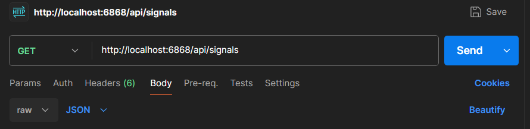
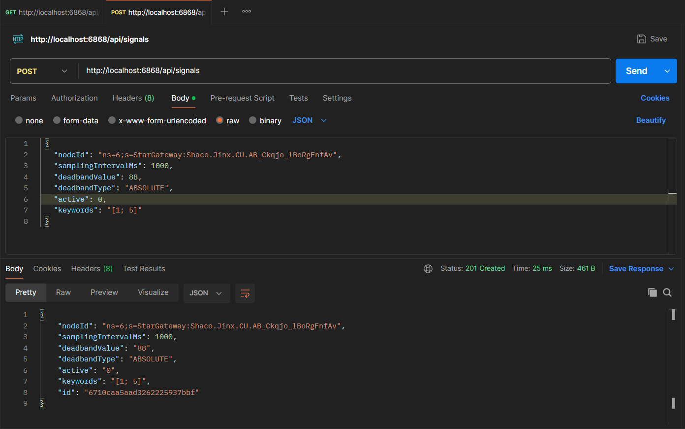

# Docker Spring Boot and MongoDB Code Challenge Robine Schelkens

## Run the System
Mke sure Docker desktop is running or this will give an error in console
Run all with a single command:
```bash
docker compose up
```

Docker will pull the MongoDB and Spring Boot images (if your machine did not have it before).

Can be run on the background with command:
```bash
docker compose up -d
```

## Stop the System
Stopping all with a single command:
```bash
docker compose down
```

## Use the API 
GET all signals


UPDATE a signal (or ADD a signal)


Other CRUD functions work the by the same principles
